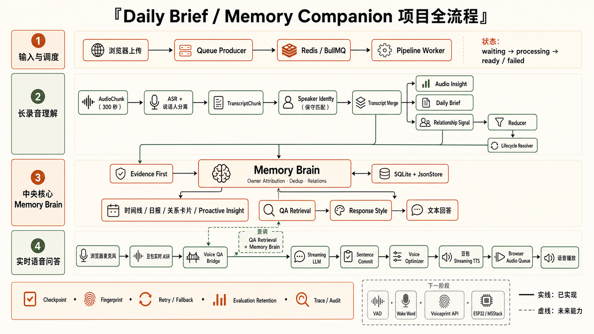
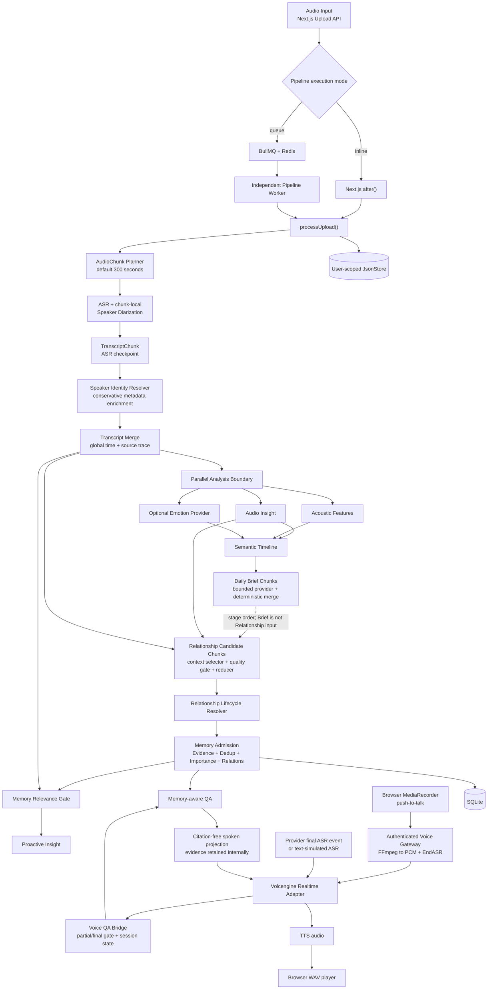
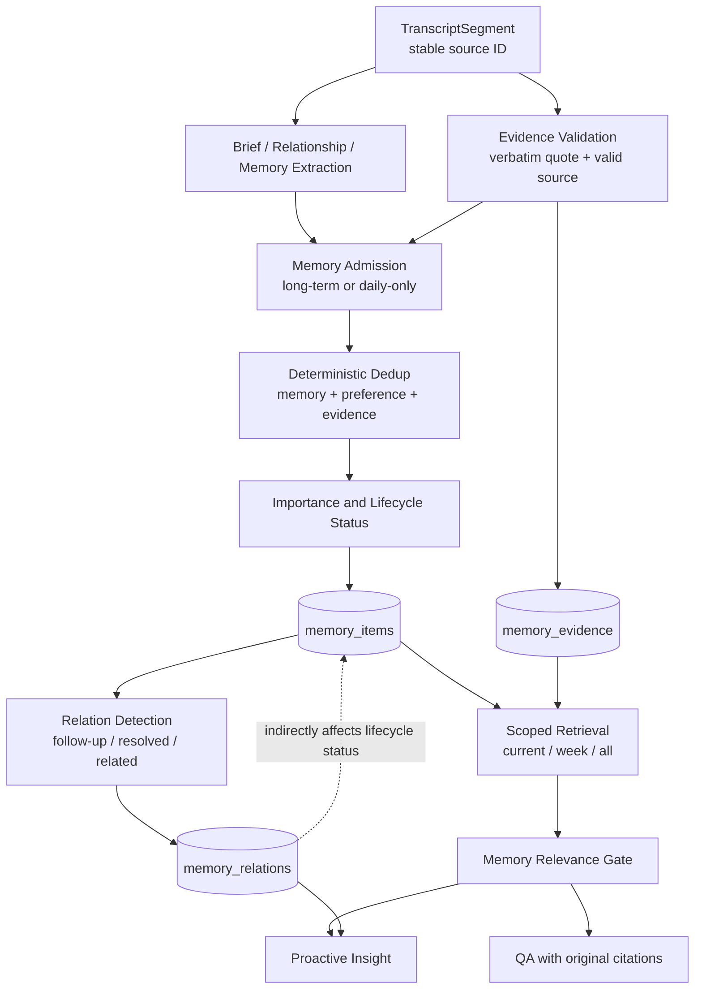
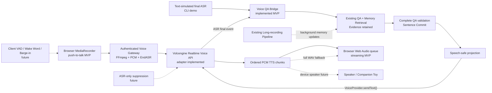

# Daily Brief / Memory Companion 系统架构

> 文档状态：当前实现快照，更新于 2026-07-20。本文面向技术评审、导师沟通和工程交接；“已实现”与“规划中”会明确区分。



## 1. 项目简介

Daily Brief / Memory Companion 是一个面向长期陪伴场景的语音理解与 Memory Agent 系统。它处理的不是一次性的“录音转摘要”，而是三个连续问题：

1. 如何稳定处理几十分钟到一小时的双人长录音；
2. 如何从逐字稿中提取可追溯的事件、承诺、偏好和关系互动；
3. 如何把单日观察转化为可检索、可去重、可演进的长期 Memory，同时为未来 Voice Agent 提供知识基础。

当前能力可概括为：

```text
Long Recording Understanding
+ Relationship Understanding
+ Evidence-backed Long-term Memory
+ QA / Proactive Insight
+ Browser Push-to-talk Voice QA MVP
```

未来方向是在当前 Browser push-to-talk 基础上增加可打断的连续语音与玩偶交互，而不是重新实现另一套记忆系统。

## 2. 总体架构

### 2.1 当前系统



图中的 Speaker Identity 位于 ASR 与 Transcript Merge 之间，这是当前代码的真实执行位置。Audio Insight、声学特征和可选 Emotion Provider 在 transcript 持久化之后并行执行；Daily Brief 完成后才进入 Relationship 阶段，但 Relationship 不消费 Brief item。当前 Relationship Provider prompt 使用 TranscriptChunk 和筛选后的 Audio Insight；SemanticSegment 用于服务端处理和证据关联，不作为当前 Provider prompt 的独立上下文块。

### 2.2 执行边界与状态边界

系统支持两种执行模式：

| 模式 | 路径 | 用途与边界 |
| --- | --- | --- |
| `inline` | Upload API → `after()` → `processUpload()` | 兼容旧开发路径；不依赖 Redis，但生命周期仍绑定 Web 进程。 |
| `queue` | Upload API → BullMQ → Worker → `processUpload()` | 持久调度、whole-job retry、startup recovery 和独立进程执行；Redis 不可用时 fail closed，不自动降级 inline。 |

BullMQ 与产品 Job 的职责刻意分开：

- BullMQ 管理 `waiting / active / delayed / completed / failed`、attempt 和 Worker lease；
- JsonStore 中的产品 Job 管理用户可见的 `waiting / processing / transcribing / extracting / ready / failed / progress`；
- 前端不直接读取 Redis；
- Worker 始终调用同一个 `processUpload()`，没有复制 ASR、Memory 或 Relationship 逻辑。

Queue payload 只包含版本、`uploadId` 和 `userRef`。稳定 Job ID 由 user + upload 的 SHA-256 生成，用于避免同一上传产生重复活跃任务。

## 3. 端到端数据流

### 3.1 Upload 与任务创建

Upload API 校验并保存音频、Upload record 和产品 Job。Queue 模式下，API enqueue 后立即返回 `waiting`；独立 Worker 读取同一个 `APP_DATA_DIR`，加载 Upload record，再调用 Pipeline。

生产 ready 后的音频遵循现有清理策略；failed、processing 和 retry 状态保留音频。显式标记的 Evaluation Retention upload 会保留音频、transcript、checkpoint、Memory、Evidence、Relations 和审计报告，未确认的 DELETE 会被拒绝。

### 3.2 AudioChunk 与 ASR

长音频首先由 provider-neutral planner 切成默认 300 秒的 `AudioChunk`。每个 chunk 由有限并发 scheduler 调用 speaker-ASR，并独立记录状态、attempt、错误和 checkpoint；某个 chunk 的重试不会取消其他 chunk。

ASR 输出被转换为 `TranscriptChunk`：

- 时间戳使用 upload-global timebase；
- segment 保留其 AudioChunk 和 provider source；
- `speaker_0 / speaker_1` 仍是 chunk-local label；
- 所有 chunk 完成后才允许进入全局 Transcript Merge，避免静默缺段。

### 3.3 Speaker Identity

`TranscriptSegment.speaker` 的原始含义不变，identity 只作为可选 metadata：

```typescript
type TranscriptSpeakerIdentity = {
  globalSpeakerId: string;
  displayName?: string;
  identityType: "known_contact" | "unknown_person";
  confidence: number;
  source: "voiceprint" | "cross_chunk_matching" | "manual_mapping";
};
```

Resolver 的证据优先级为 manual mapping、voiceprint hint、可注入 matcher。它使用 confidence threshold、最佳/次佳 margin 和同 chunk 冲突检查；证据不足时创建稳定的 unknown identity，而不会把相邻 chunk 的同名 local label 强行当作同一个人。

当前真实 Provider 只稳定返回 local speaker label。受控接口验证没有获得 `speaker_id`、identity confidence、embedding 或可用的 train/save 契约，因此当前生产路径不能宣称已完成真实跨 chunk 或跨录音人物识别。

### 3.4 Transcript Merge

Merge 层把多个 TranscriptChunk 归并为全局 `TranscriptSegment[]`，负责：

- 全局唯一 segment ID；
- 单调且不越界的时间戳；
- AudioChunk / local segment source trace；
- 仅在边界重叠、文本高度相似且 speaker 一致时进行保守去重；
- 保留 Speaker Identity metadata，不覆盖原始 local speaker。

Merge 是确定性过程，不再调用 LLM。

### 3.5 Analysis Layers

Transcript 持久化后，三个可独立降级的分支并行运行：

| 分支 | 主要职责 | 失败边界 |
| --- | --- | --- |
| Audio Insight | 提取事件、情绪、观察和互动线索 | 每 TranscriptChunk checkpoint、有限 retry、rule fallback。 |
| Acoustic | 使用 FFmpeg 提取可融合的声学特征 | 失败时保留文本 Audio Insight。 |
| Emotion | 接收可选外部 emotion evidence | Provider 未配置或失败时为空，不阻断主链路。 |

这些结果合并后构建确定性的 Semantic Timeline。

### 3.6 Daily Brief

Daily Brief 使用 Semantic Timeline 引导 extraction chunk 规划。它的实际产物是 evidence-backed 结构化重要事项，而不是另一次长篇叙事摘要。first pass 默认有限并发 2；可重试失败进入有界 recovery queue，最终失败才使用 rule fallback。每个 chunk 都经过 structured JSON 提取、严格 Zod validation、Evidence validation 和 AnalysisChunk checkpoint，最后按 chunk index 做确定性 merge。

最终 Daily Brief schema 和 Evidence First 契约不依赖 Provider 的返回顺序，也没有第二次 LLM reduce。

### 3.7 Relationship Signal

Relationship 阶段对每个 TranscriptChunk 构建受控输入：完整 transcript segment、必要的 speaker/time/source 信息，以及由 deterministic context selector 选择和压缩的相关 Audio Insight。Provider 返回 compact candidate，服务端再从真实 TranscriptSegment 回填 evidence。

随后依次执行：

```text
compact provider candidates
-> strict validation and source-ID validation
-> candidate quality gate
-> deterministic clustering and reducer
-> quality-aware selection
-> RelationshipSignalCard
```

Quality gate 和 reducer 综合 evidence quality、specificity、actionability、information gain、confidence 和 redundancy penalty。普通寒暄、泛泛支持和无新增信息的重复候选会降权；它们不是通过固定 `slice(0, N)` 或删除某个时间窗口来处理。

### 3.8 Relationship Lifecycle

Lifecycle Resolver 在现有 reducer 之后运行，不替换 Relationship Card schema，也不新增 LLM。它从 candidate（不可用时退回 card）构建内部 signal view，按 signal type compatibility、事件/目标、时间方向、speaker interaction context 和 temporal proximity 生成：

```text
question   -> answered_by
plan       -> resolved_by
commitment -> fulfilled_by
concern    -> resolved_by
update     -> updated_by
```

不同实体、不同目标、不同显式时间或缺乏共同互动上下文的 pair 会被拒绝并记录原因。当前 Resolver 作用域是单次 upload；跨日期生命周期仍由 Memory 层的长期关系继续演进。

### 3.9 Memory、QA 与 Proactive Insight

Memory extractor 综合 transcript、Daily Brief、Semantic Timeline、Relationship Card 和 lifecycle metadata，经过 admission、evidence dedup、preference identity dedup、importance 和 relation detection 后写入 SQLite。

QA 支持 current / week / all scope，从 Memory 和原始 evidence 中检索上下文，并保留原始 citation。Proactive Insight 同时读取当前 evidence 和有限长期 Memory，通过 Memory Relevance Gate 排除不相关记忆，再经过安全 validator 输出观察与建议问题。

Memory index 写入失败当前是可降级边界：Pipeline 会记录错误并继续生成当前录音结果；这提高主链路可用性，但意味着 `ready` 不应被解释为所有可选索引都必然成功，Evaluation report 才是完整审计依据。

### 3.10 Voice Interface 与 Voice QA Bridge

Voice Interface 是现有 Memory Agent 的输入输出层，不维护另一份长期记忆，也不绕过 QA。Volcengine Realtime adapter 负责 WebSocket connection/session、ASR/TTS 事件和音频字节；`VoiceQaBridge` 负责区分 partial/final transcript、串行化问答 turn，并驱动 `idle -> listening -> thinking -> speaking -> idle` 状态机。Provider 的 final transcript 只先缓存，必须等当前 turn 的 `ASREnded` 后才进入 QA，满足 Realtime 协议对后续 `ChatTTSText` 的顺序要求。

```text
provider final ASR event or text-simulated ASR
-> Voice QA Bridge
-> existing current/week/all QA entry
-> Memory retrieval + evidence-backed QuestionAnswer
-> VOICE spoken projection
-> VoiceProvider.sendText()
-> TTS audio
```

VOICE projection 只派生适合朗读的文本视图：citation 标记和 Markdown 不送入 TTS，但原始 `QuestionAnswer`、evidence 和 citation 仍保留在内部 response 中。CLI demo 继续使用文本模拟 final ASR 做确定性验证；浏览器麦克风入口由嵌入现有问答工作区的 gateway 提供。

Browser Voice QA MVP 在该桥接层外增加了一个 turn-scoped gateway：浏览器只在用户主动按下按钮后使用 `MediaRecorder` 录制完整问题，后端鉴权后把 WebM/Ogg/MP4/WAV 转为文档要求的 16 kHz、mono、PCM16LE，并以 `push_to_talk` 模式按 20 ms / 640 bytes 送入现有 Bridge。全部音频包发送成功后，Gateway 通过 Provider Adapter 发送 `EndASR (400)`，显式完成本轮输入；只有收到 `ASREnded (459)` 后才进入 QA。

语音输出支持两条兼容路径。旧客户端继续等待 24 kHz mono PCM16LE 全部完成，由后端封装为 WAV；显式请求 `application/x-ndjson` 的客户端只接收完整 QA 校验后原子提交的 speech-safe sentences，逐句送入同一 Voice Provider，并把有序 PCM chunks 交给浏览器 Web Audio queue。raw token、未验证 sentence、validation fallback 和 unsupported stream 不进入流式 TTS；这些情况保留既有完整 QA + WAV fallback。

```text
Browser MediaRecorder
-> authenticated POST /api/voice/qa
-> bounded FFmpeg conversion (memory only)
-> PCM16LE push-to-talk packets
-> EndASR (400)
-> existing Voice QA Bridge / Memory-aware QA
-> spoken text + internal citation trace
-> complete validation + SentenceCommitManager
-> Streaming Voice Optimizer
-> ordered PCM TTS chunks over NDJSON
-> Browser Web Audio queue

fallback:
-> full PCM TTS -> WAV Base64
-> existing Browser audio player
```

每次 push-to-talk 是一个短生命周期 Provider session；Next.js 不保存跨请求 WebSocket registry，原始麦克风录音也不写入磁盘。Bridge 根据 `TTSSentenceStart.tts_type` 只收集 `chat_tts_text` 音频，忽略端到端 Provider 自主产生的 `default` TTS，并在字段存在时保守校验 `question_id / reply_id`。页面刷新或用户取消会停止 recorder/tracks、终止前端请求、取消 AudioQueue 并传播 `AbortSignal`；服务端 deadline 会立即从 Bridge 脱离并启动有界 Provider cleanup。

当前流式闭环缩短的是“完整 TTS 合成完毕”到“首个 PCM buffer 可播放”的尾部，不会绕过完整 QA 校验，也还不能让 TTS 与 LLM token generation 重叠。流式 TTS 和 NDJSON/Web Audio 路径已有 mock regression，但尚未对真实 Volcengine 多句 TTS 做本轮受控验收，因此不能把这一新增路径描述为远端生产验证完成。

## 4. 核心模块职责

| 模块 | 主要路径 | 职责 |
| --- | --- | --- |
| Upload API | `src/app/api/uploads/route.ts` | 保存 upload 和产品 Job，选择 inline/queue，enqueue 后返回。 |
| Queue Producer / Worker | `src/lib/server/queue/`, `src/worker/` | 稳定 Job ID、BullMQ lifecycle、whole-job retry、startup recovery、graceful shutdown。 |
| Pipeline Orchestrator | `src/lib/server/pipeline/process-upload.ts` | 编排现有阶段、持久化产物、状态/进度、cleanup 与 Evaluation report。 |
| Unified Chunk Model | `src/lib/domain/chunks/` | 定义 AudioChunk、TranscriptChunk、AnalysisChunk 和状态不变量。 |
| ASR / Transcript | `src/lib/server/transcription/` | 音频分片、speaker-ASR、chunk checkpoint、global merge 和 source trace。 |
| Speaker Identity | `src/lib/server/speaker-identity/` | 保守身份解析、manual mapping repository、voiceprint adapter abstraction 和 audit。 |
| Audio Insight | `src/lib/server/audio-insights/` | chunk provider、fallback、merge 和 checkpoint。 |
| Daily Brief | `src/lib/server/extraction/` | semantic-guided chunks、structured output、retry/fallback、Evidence validation 和 deterministic merge。 |
| Relationship | `src/lib/server/relationship-signals/` | context selector、compact provider contract、candidate gate、clustering、reducer 和 cards。 |
| Lifecycle | `src/lib/server/relationship-signals/lifecycle/` | question/plan/commitment/concern 的确定性状态边。 |
| Memory | `src/lib/server/memory/` | extraction、admission、evidence、dedup、preference identity、importance、relations、retrieval。 |
| QA / Proactive | `src/lib/server/retrieval/`, `src/lib/server/proactive-insights/` | Memory-aware QA、citation、relevance gate、主动观察和问题建议。 |
| Realtime Voice Adapter | `src/lib/server/voice/` | Volcengine WebSocket 协议、connection/session lifecycle、ASR/TTS 事件和音频回调。 |
| Voice QA Bridge | `src/lib/server/voice-qa/` | final transcript gate、现有 QA adapter、会话状态、sentence safety preflight、流式/完整 TTS fallback。 |
| Browser Voice QA | `src/components/qa-voice-workspace.tsx`, `src/components/voice/`, `src/app/api/voice/qa/` | 问答工作区内嵌 push-to-talk、MediaRecorder、受限音频转换、NDJSON PCM queue，以及兼容 WAV playback。 |
| Evaluation | `src/lib/server/evaluation/`, `scripts/` | retention、Evidence First audit、stage replay、checkpoint/queue/长录音报告。 |

## 5. 核心设计原则

### 5.1 Evidence First

Memory 和 Relationship 不是无来源的模型结论。关键约束是：

- source ID 必须存在于本次可访问的真实 artifact；
- transcript quote 必须逐字可追溯；
- Provider 不负责生成可信 quote、speaker 或时间范围，能确定性回填的字段由服务端回填；
- invalid source、non-verbatim quote、duplicate evidence、orphan evidence 都进入审计；
- speaker identity enrichment 不改变 segment ID、timestamp 或原始 speaker。

### 5.2 LLM 理解 + Deterministic 治理

LLM 负责难以用规则完成的 extraction 和语言理解；确定性层负责 schema validation、source validation、merge、dedup、quality gate、lifecycle、importance、relations 和 audit。

这种分工的代价是规则层可能保守漏召回，但它让系统能够解释“为什么保留、拒绝或连接”，也避免为通过 validation 而猜测缺失字段或伪造 evidence。

### 5.3 Checkpoint-driven Processing

ASR chunk 和 AnalysisChunk 都有持久状态，但恢复粒度不同。通用 AnalysisChunk checkpoint 包含：

- input fingerprint；
- processor fingerprint；
- attempt / result source；
- validated output；
- 有限、脱敏 diagnostics。

fingerprint match 的 completed chunk 直接复用；stale、corrupt 或输入变化只重算对应 chunk。确定性 merge/reducer 成本低，因此可在 checkpoint 恢复后重新执行。

ASR checkpoint 当前主要记录 AudioChunk / TranscriptChunk 的运行与审计状态。Queue retry 只有在全局 merged `segments` 已经原子落盘时才能整体跳过 transcription；如果进程在 merge/segments 写入前崩溃，现有 scheduler 仍可能重新转写已成功的 ASR chunks。它还不是完整的逐 ASR chunk resume。

### 5.4 有限并发与分层 Retry

完整 Pipeline 的 Worker concurrency 默认 1，因为 Pipeline 内部已有 ASR、Audio Insight、Daily Brief 和 Relationship chunk 并发。Chunk retry 处理 Provider 局部失败；Queue retry 处理 Worker crash 或 process failure。二者边界分开，避免 provider retry × chunk retry × whole-job retry 无界放大。

### 5.5 Conservative Identity

身份错误会污染承诺归属、Preference owner 和长期 Memory，因此“unknown”是合法结果。只有 manual mapping、明确 voiceprint hint 或高置信 matcher 证据才能产生可复用 global identity；不使用 label 名称、说话比例或文本内容猜身份。

### 5.6 调度状态与业务状态分离

Redis 不是业务数据源。即使 Queue Job completed，产品状态仍以 JsonStore 中的 Upload / Job 为准；Memory 以 SQLite 为准；Evidence 和 transcript 仍可回到文件 artifact。该分离降低前端与基础设施耦合，也使 Queue 可替换。

## 6. Memory 数据流



同一个 source segment 可以支持不同 Memory；Evidence 去重使用最终 memory ID、upload/source ID 和规范化 quote，而不是简单按 source ID 全局删除。稳定 Preference 使用内部 preference identity 合并，同一事实更新 occurrence 和 evidence，不把一次性选择自动升级为长期偏好。

当前 QA 直接消费的是 Memory 与可映射回原始来源的 Evidence，`memory_relations` 不直接进入 QA prompt；relations 会影响 Memory lifecycle/status，并作为 Proactive Insight 的上下文。图中的 relations 到 QA 因而是间接影响，而不是已实现的直接调用链。

## 7. 存储与生命周期

| 存储 | 内容 | 是否为业务真相 | 当前部署假设 |
| --- | --- | --- | --- |
| 文件 / user-scoped JsonStore | users、uploads、jobs、segments、chunks、analysis checkpoints、brief、relationship、audit、settings | 是 | Web 与 Worker 必须共享同一 `APP_DATA_DIR`。 |
| SQLite | memory items、evidence、relations | 是 | 与 `APP_DATA_DIR` 同机持久化，需连同 WAL/SHM 一起迁移。 |
| Redis / BullMQ | waiting、active、retry、progress、completed/failed record | 否，负责调度 | AOF、noeviction、loopback；当前单机单 Worker。 |
| 原始音频 | ASR 输入与必要审计 artifact | 有条件 | processing/failed/retry 保留；production ready 按策略清理；evaluation 显式保留。 |

不能只迁移 `memory.sqlite`。用户、Upload、产品 Job、transcript 和 checkpoint 都依赖完整 `APP_DATA_DIR`。服务器部署细节见[服务器部署说明](../deployment/server-deployment.md)。

## 8. 已完成能力

“完成”表示代码路径、测试和相应审计已经存在，不等于所有真实 Provider 质量问题都消失。

| 模块 | 当前状态 | 说明 |
| --- | --- | --- |
| Long Recording Chunk Pipeline | 已完成 | 300 秒默认 AudioChunk、有限并发、失败隔离和全局 merge。 |
| Queue / Independent Worker | 已完成 | BullMQ + Redis、稳定 Job ID、whole-job retry、startup recovery、graceful shutdown。 |
| ASR Chunk Retry / Checkpoint | 已完成，恢复粒度有限 | 每 chunk 有状态、retry 和审计；完整 chunk 集才进入下游，但 merge 前 crash 尚不能保证逐 chunk 命中恢复。 |
| Transcript Merge | 已完成 | 全局 ID、timestamp、source trace 和保守边界去重。 |
| Audio Insight | 已完成 | chunk provider、fallback、checkpoint 和 deterministic merge。 |
| Daily Brief | 已完成 | semantic-guided chunks、bounded concurrency、diagnostics、retry/fallback、merge。 |
| Relationship Signal | 已完成 | context compression、compact contract、quality gate、reducer、Evidence backfill。 |
| Relationship Lifecycle Resolver | 已完成 | 单次 upload 内确定性 lifecycle edge 与审计。 |
| Memory Index | 已完成 | SQLite、Evidence First、admission、importance、dedup、relations、lifecycle。 |
| Preference Dedup | 已完成 | 保守 preference identity、同事实合并、一次性选择拒绝。 |
| Memory-aware QA | 已完成 | current/week/all scope、原 citation 保留。 |
| Proactive Insight + Relevance Gate | 已完成 | 当前 evidence + 有限相关 Memory + 安全 validation。 |
| Evaluation Retention / Replay | 已完成 | retained audit、stage-only replay、checkpoint 和 Evidence First 验证。 |
| Speaker Identity Layer | 框架完成，真实匹配待接入 | metadata、resolver、manual repository、adapter 和 audit 已完成；无可靠真实 voiceprint evidence 时保持 unknown。 |
| Voiceprint API Adapter | 基础接口完成，等待真实契约 | train/save abstraction 已有；受控真实 API 未证明可用 identity contract。 |
| Volcengine Realtime Voice Adapter | MVP 已完成 | WebSocket connection/session、文本发送、ASR/TTS 事件和音频保存；不作为新的 Memory/QA 模型。 |
| Voice QA Bridge | Streaming closure 已完成，真实多句 TTS 待验收 | final ASR 触发现有 QA、partial 不触发、原子 sentence preflight、ordered TTS chunks 和完整 TTS fallback。 |
| Browser Voice QA | Streaming MVP 已完成，真实远端待验收 | 内嵌 push-to-talk、NDJSON PCM chunks、Web Audio queue、取消/cleanup 和兼容 WAV fallback；已有 mock regression。 |
| Realtime / Always-listening Voice Agent | 未实现 | client VAD、wake word、barge-in、连续 session 和受控 ASR-only provider mode 尚未实现。 |

## 9. 质量验证现状

### 9.1 真实完整 Pipeline

| 指标 | 45 分钟 Queue retained run | 60 分钟 Queue run |
| --- | ---: | ---: |
| Pipeline / BullMQ | ready / completed，attempt 1 | ready / completed，attempt 1 |
| Pipeline wall-clock | 390.270 s | 422.414 s |
| ASR | 9/9，232 segments，0 retry | 12/12，307 segments，0 retry |
| Audio Insight fallback | 1/9 | 0/12 |
| Daily Brief | 6/6 provider success，0 fallback | 8 checkpoints，0 retry，0 fallback |
| Relationship | 8 provider success，1 validation fallback | 9 success，3 validation fallback |
| Relationship cards | 23 | 23 |
| Memory / Evidence / Relations | 33 / 148 / 11 | 30 / 205 / 9 |
| Evidence First | 五项均为 0 | `duplicateEvidence=1`，其余四项为 0 |
| Evaluation Retention | 完整保留 | 完整保留，未确认 DELETE 返回 409 |

45 分钟结果证明 Queue、独立 Worker、checkpoint、retention 和完整 Memory/Evidence 路径可以协同达到 ready。60 分钟结果同样完成主链路，但质量 verdict 是失败：Relationship 三个 chunk 因 `confidence` 类型漂移进入 fallback，且发现一条重复 Evidence，因此不能把“Pipeline ready”写成“全部质量门通过”。

### 9.2 后续离线修复与回归

60 分钟问题之后完成了 closed-set Relationship confidence normalization、统一 Evidence storage dedup 和 Preference identity dedup。它们通过 mock、fixture 和 retained artifact 的只读/隔离回放验证：

- retained Evidence 只读计算为 `205 -> 204`，可确定性移除 1 条重复；
- 隔离 Memory replay 的 Evidence First 五项为 0；
- confidence 仅允许 `high / medium / low` 映射为 `0.85 / 0.65 / 0.35`，其他字符串仍由 Zod 拒绝；
- 这些修复没有重新运行完整 60 分钟远端 Pipeline，因此真实 fallback before/after 尚未验证。

其他离线质量证据包括：

- 45 分钟 Memory quality replay：Memory `47 -> 25`，Relationship Memory `15 -> 2`，Preference `0 -> 1`，Relations `2 -> 10`，Evidence First 五项为 0；
- 多日 fixture：Must `14/14`、Should `7/7`、Must Not `0`，两次 digest 一致；
- 60 分钟 lifecycle retained replay：检查 990 个时间有向 pair，生成 3 条陶艺相关 edge，未观察到 accepted 跨事件误连；该 replay 没有覆盖可靠的 concern resolution；
- 60 分钟 Speaker Identity retained replay：24 个 chunk-local speaker groups 中 `matched=0`、`unknown=24`，准确反映真实 artifact 缺少 identity evidence；synthetic matcher 的 label-swap 测试通过，但不能视为真实声纹准确率。

对应的隐私安全数据集见[45 分钟基准](../../test-data/long-recording-45m-v1/README.md)和[60 分钟基准](../../test-data/long-recording-60m-v1/README.md)。运行报告位于本地 Git-ignored `.data/evaluation/`，不会随仓库发布。

## 10. 当前限制

### 10.1 Speaker Identity

- ASR 当前可靠提供的是 chunk-local speaker label；
- 真实 API 验证未获得稳定联系人 ID、identity confidence 或 embedding；voiceprint train/save 未验证成功；
- 没有 manual mapping / voiceprint hint / matcher evidence 时，每个 local group 保持 unknown；
- 默认 speaker-ASR 路径会加载 manual mappings，但不会自动注入真实 voiceprint hints 或 acoustic matcher；其他 transcription Provider 也不经过这一 resolver；
- 因此系统不能可靠回答跨 chunk 或跨录音的“这个人是谁”，也不能声称 speaker reconciliation 已完成。

### 10.2 Memory Owner Attribution

Memory schema 尚无完整的 user / partner owner attribution 契约。Relationship evidence 可以显示可信 identity metadata，但稳定 Preference、承诺和 QA 的 owner 仍不能在低身份置信度下强绑定联系人。

### 10.3 Lifecycle Scope

Relationship Lifecycle Resolver 当前擅长单次 upload 内、显式事件实体和前后状态都较清楚的场景。代词、省略主题、跨日期或跨 upload 的生命周期会保守漏连；它也不负责判断谁对谁错或做心理推断。

### 10.4 Provider 稳定性

长录音真实验收仍观察到 Audio Insight 或 Relationship 的偶发 validation fallback。Checkpoint、retry 和 rule fallback 能保证主链路继续，但 fallback 必须在审计中显式标记，不能冒充 Provider success。

### 10.5 Queue 与存储扩展性

当前是单机共享文件系统、单 Worker 的架构：

- JsonStore 的写锁是进程内锁，不是跨主机事务或 fencing；
- Web 与 Worker 必须访问同一 `APP_DATA_DIR` 和 SQLite；
- 不能直接把 Worker 扩为多实例或迁到没有共享存储的另一台机器；
- BullMQ completed/failed record 尚需长期 pruning/archival 策略。

此外，ASR chunk checkpoint 目前不是完整的逐 chunk crash resume；若全局 transcript 尚未落盘，whole-job retry 可能重新调用已成功的 ASR chunk。

### 10.6 Voice Interaction

当前已具备 Volcengine Realtime adapter、Voice QA Bridge 和 Browser push-to-talk gateway：adapter 能接收 ASR event、发送 QA 文本并收集 TTS audio；bridge 只在 final transcript 上调用现有 QA，并只把完整校验后、具有 sentence-local support 的语句交给 Streaming Voice Optimizer。浏览器语音侧栏可消费有序 NDJSON PCM chunks 并通过 Web Audio queue 连续播放；无法形成安全 sentence commit、流式 TTS 首块前失败或旧客户端请求时，仍使用完整 WAV 路径。实现和 mock/本地 FFmpeg 测试已完成，但本轮没有调用真实 Volcengine 多句流式 TTS，因此不等同于远端 Streaming Voice 验收。

浏览器已经实现显式 push-to-talk microphone capture 和回答阶段取消，但尚未实现 VAD、wake word、真正的 barge-in、可恢复的 HTTP stream reconnect，以及确保 Provider 只做 ASR/TTS 的抑制能力。豆包端到端实时模型可能在收到用户音频后自主发出 `ChatResponse` / `TTSResponse`；当前 bridge 会忽略 `ChatResponse` 对 QA 的触发，并按 `tts_type` 过滤音频，但尚不能从协议层禁止 Provider 自主生成。因此在确认 ASR-only suppression 和真实多句事件顺序前，不能把新增 streaming path 描述成生产远端验收完成。

## 11. 下一阶段：Voice Agent / 玩偶交互

Voice Agent 应作为现有 QA、Memory 和 Evidence 系统的交互层，而不是绕过它们直接让实时模型维护另一份记忆。



### Phase 1：Voice QA

```text
browser push-to-talk recording
or text-simulated final ASR (CLI demo)
-> authenticated Voice Gateway
-> 16 kHz mono PCM push-to-talk stream
-> EndASR (400)
-> Voice QA Bridge
-> existing Memory-aware QA
-> complete Evidence/citation validation
-> sentence commit + speech-safe projection
-> ordered Realtime TTS chunks
-> Browser Web Audio queue

fallback: full QA projection -> full WAV playback
```

MVP 已复用现有 current/week/all QA、Memory、Evidence 和 response style，并实现 session lifecycle、partial/final gate、sentence safety preflight、ordered TTS chunks 及 ASR/QA/TTS 错误降级。Browser 页面增加显式 push-to-talk、权限处理、60 秒上限、服务端转码、Web Audio queue 和取消 cleanup；内部保留 citation，朗读文本不念 citation。真实 Provider 的 ASR-only suppression、多句 TTS 事件顺序和端到端首响延迟仍需单次受控验证。

### Phase 2：Voice Companion

增加 VAD、wake word、streaming ASR、可打断 TTS、session state 和低延迟 Agent loop。离线长录音 Pipeline 继续在后台处理高成本的关系理解与长期 Memory；实时链路只读取经过 admission 的 Memory，并把新交互异步送回同一 Evidence 流程。

### Phase 3：AI Persona / Companion

在取得明确授权和身份可靠性之后，才组合：

- voice identity；
- speaking style 与可配置 persona；
- interaction memory；
- relationship history；
- 设备侧隐私、家长/监护策略和数据删除能力。

这一阶段的关键不是“更像人”，而是确保 persona 不覆盖事实、不把 unknown speaker 错绑给联系人，也不把短期情绪自动固化为长期人格判断。

### 建议的演进顺序

1. 对现有 Browser push-to-talk 路径做一次受控真实短语音验收，并确认 Provider 的 ASR-only suppression，避免端到端模型自主 Chat/TTS 与 Memory Agent 重复回答；
2. 与 ASR 服务方确认真实 stable speaker/voiceprint contract，再接入已存在的 identity adapter；
3. 为 Memory 增加内部 owner attribution 设计和迁移方案；
4. 再引入 VAD、wake word、barge-in 和 streaming interruption；
5. 最后评估玩偶端的本地唤醒、权限、断网降级和隐私边界。

## 12. 技术栈

| 层 | 当前技术 |
| --- | --- |
| Web / Backend | Next.js 15、React 19、TypeScript 5.8、Node.js 22+ |
| Validation | Zod |
| Queue | BullMQ、ioredis、Redis 7.4 AOF |
| Structured Storage | user-scoped JsonStore、better-sqlite3 |
| Audio | FFmpeg / FFprobe、外部 speaker-ASR |
| AI Providers | DeepSeek、OpenAI-compatible Provider adapter、Volcengine Realtime Voice WebSocket |
| Testing | Vitest、Testing Library、Playwright、离线 replay / audit scripts |
| Deployment | Docker Redis、PM2 Web + Worker、共享 `APP_DATA_DIR` |

## 13. 主要 Trade-off

| 决策 | 获得 | 代价 |
| --- | --- | --- |
| Chunk + checkpoint | 长任务可恢复、局部失败隔离 | artifact 和 fingerprint 管理更复杂。 |
| LLM extraction + deterministic governance | 保留语义能力，同时可验证 evidence | 规则较保守，可能漏掉隐含关系。 |
| Redis 调度、JsonStore/SQLite 业务状态 | 前端与 Queue 解耦、可替换调度层 | 需要处理跨存储最终一致性。 |
| 单 Worker + 内部有限并发 | 控制 Provider 压力和本地存储竞争 | 当前不能水平扩展完整 Pipeline。 |
| Identity unknown 优先 | 避免错误归属污染长期 Memory | 在 voiceprint contract 就绪前，个性化归属能力有限。 |
| Rule fallback 保主链路 | Provider 抖动时仍可 ready | ready 不等于所有模型阶段都成功，必须依赖审计。 |

## 14. 延伸阅读

- [Long Recording ASR Chunks](./long-recording-asr-chunks.md)
- [Unified Chunk Model](./unified-chunk-model.md)
- [Server Deployment](../deployment/server-deployment.md)
- [Validation Tools](../validation-tools.md)
- [Project Handoff](../project-handoff.md)
