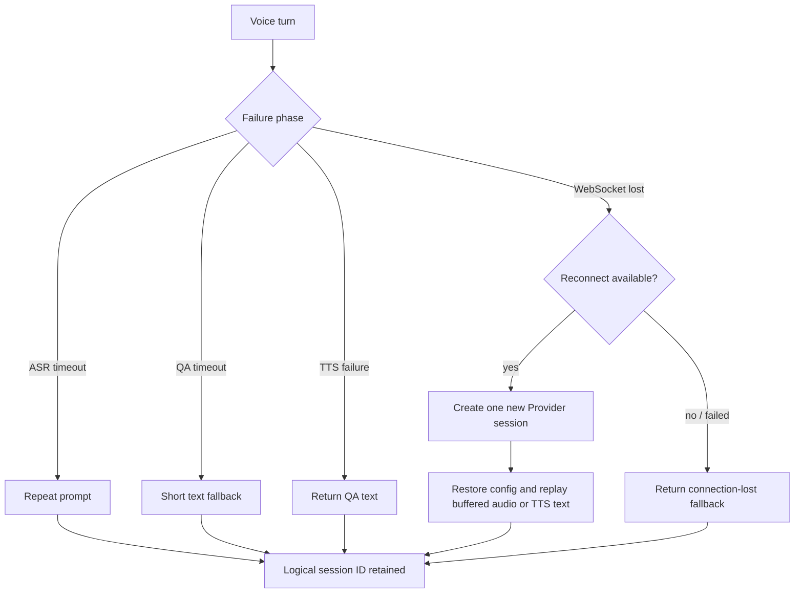

# Voice QA Failure Recovery

## Scope

Voice recovery sits in the interface layer. It does not alter long-recording
ASR, Memory admission, Relationship resolution, Evidence First, or QA
retrieval. Recovery decisions are deterministic and do not add an LLM call.

The implementation is split between:

- `src/lib/server/voice-qa/error-handler.ts`: safe user-facing decisions and
  bounded reconnect orchestration;
- `src/lib/server/voice-qa/bridge.ts`: ASR/QA/TTS phase boundaries, text
  fallback, and replay of the current buffered audio after reconnect;
- `src/lib/server/voice/volcengine-realtime.ts`: one-attempt WebSocket/session
  reconstruction using the last validated session configuration;
- `src/lib/server/voice-qa/session-manager.ts`: durable short-term context that
  survives a turn-scoped Provider connection loss.

## Error contract

| Code | Trigger | User-visible behavior | Session behavior |
| --- | --- | --- | --- |
| `VOICE_ASR_TIMEOUT` | no final ASR result within the bounded ASR phase | asks the user to repeat | logical session and prior context are retained |
| `VOICE_QA_TIMEOUT` | QA does not finish within its bounded phase | returns a short context-aware or generic text fallback | logical session remains usable; the timed-out answer is not spoken later |
| `VOICE_TTS_FAILED` | TTS request, stream, or audio validation fails | returns the already validated text answer | evidence-bearing QA result is preserved |
| `VOICE_CONNECTION_LOST` | the Provider socket cannot be restored | reports the interruption without inventing an answer | logical session is retained for the next push-to-talk turn |

The legacy lowercase `errors` array remains for API compatibility. The new
uppercase codes are returned separately as `errorCodes`.

## Recovery flow

Each `reconnect()` call creates at most one new socket and one Provider
session. `VoiceErrorHandler` defaults to one call, with a hard maximum of three
when explicitly configured. There is no unbounded reconnect loop.

For an ASR disconnect, the Bridge retains only the current turn's bounded PCM
chunks and replays them after a successful reconnect. For a TTS disconnect,
the already optimized spoken text is sent once more. If restoration fails, the
Bridge degrades to text instead of crashing or losing the logical conversation
session.

After reconnect, ASR and TTS events are matched against the newly returned
Provider session ID; the application session ID remains unchanged. A failed
ASR reconnect returns `VOICE_CONNECTION_LOST` rather than misclassifying the
turn as ordinary recognition failure. A failed TTS reconnect reports both
`VOICE_CONNECTION_LOST` and `VOICE_TTS_FAILED`, because the socket failed and
the already prepared text could not be synthesized.

The default phase bounds are 30 seconds after audio streaming for ASR, 60
seconds for QA, and 60 seconds for TTS. The Browser Gateway's 240-second outer
deadline leaves room for the maximum 60-second push-to-talk recording to be
converted and streamed before those phase bounds.

## Session restoration

The application `conversationSessionId` is deliberately separate from the
Volcengine Provider session ID. A reconnect may replace the Provider session
ID while the application session keeps its conversation context, current
topic, and retrieved Memory IDs. The next browser turn sends the same logical
session ID back to `/api/voice/qa`.

No failed voice turn is promoted into long-term Memory.

## Debugging

Set `VOICE_DEBUG=true` only while diagnosing a local or controlled environment.
The adapter and Bridge then emit structural records for:

- WebSocket connect, close, reconnect, and Provider events;
- ASR result/final/partial counts;
- QA start, completion, timeout, and elapsed milliseconds;
- TTS start, completion, failure, and audio byte count.

Logs never include transcript text, answer text, Provider payloads, raw audio,
credentials, tokens, or Authorization headers. Production remains unchanged
while `VOICE_DEBUG` is absent or false.

## Current limitations

- Mid-turn replay is intentionally limited to the current buffered turn. It is
  not a general offline queue for microphone audio.
- A QA timeout does not cancel an already-running Provider/LLM operation when
  the underlying client has no cancellation hook. Its late result is observed
  to prevent an unhandled rejection but is never sent to TTS.
- Browser page loss can prevent client playback telemetry from reaching the
  server; this is separate from Provider connection recovery.
- `VoiceSessionManager` uses a process-local read/modify/write queue. Multiple
  web processes need a future cross-process CAS or lease for the same logical
  session.
