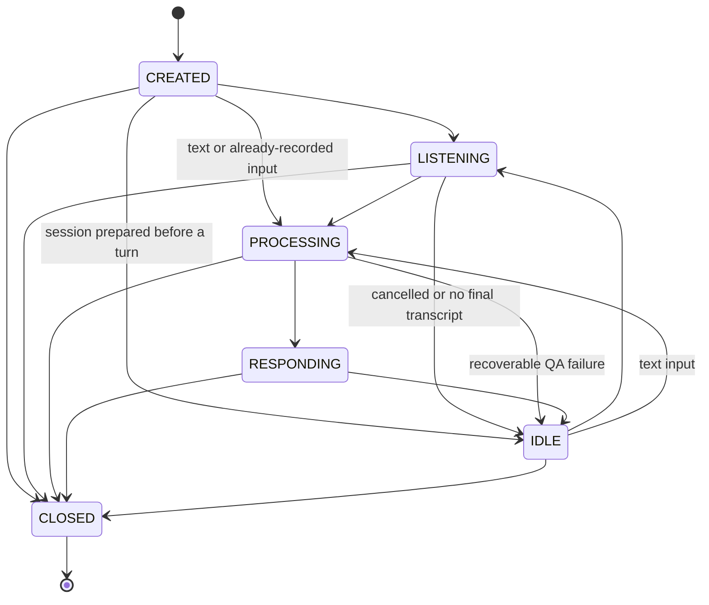

# Voice Session Management

## Purpose

The browser Voice QA flow previously created a new bridge instance for each
request. The bridge could pass an in-memory `conversation` array to QA, but the
array disappeared when that request ended. `VoiceSessionManager` provides a
small, durable short-term context boundary for follow-up questions without
changing Memory admission or the QA retrieval algorithm.

The manager is intentionally not a second long-term Memory system. Sessions
expire, context is bounded, and topic or memory identifiers must come from
existing trusted application logic rather than inference inside the manager.

## Stored model

`src/lib/server/voice-qa/session-manager.ts` stores one JSON record per session
in the existing `JsonStore` collection `voice-sessions`.

```ts
type VoiceSession = {
  version: 1;
  sessionId: string;
  userId?: string;
  createdAt: string;
  lastActivityAt: string;
  expiresAt: string;
  recentTranscript: string[];
  conversationContext: Array<{
    role: "user" | "assistant";
    content: string;
  }>;
  retrievedMemoryIds: string[];
  currentTopic?: string;
  state:
    | "CREATED"
    | "LISTENING"
    | "PROCESSING"
    | "RESPONDING"
    | "IDLE"
    | "CLOSED";
};
```

The default session TTL is 30 minutes after the latest activity. By default,
only eight recent transcripts, eight conversation messages, and 64 distinct
retrieved Memory IDs are retained. These limits are configurable when the
manager is constructed, subject to hard validation limits.

## Lifecycle



Illegal transitions fail without changing the stored record. `CLOSED` is
terminal. A closed record remains available until its normal TTL expires so a
caller can inspect the terminal state.

## API

```ts
const sessions = new VoiceSessionManager({
  store: authenticatedUserStore,
  ttlMs: 30 * 60 * 1000
});

const session = await sessions.create({ userId });
await sessions.claimTurn(session.sessionId, userId);
await sessions.transition(session.sessionId, "PROCESSING", userId);

const restored = await sessions.lookup(session.sessionId, userId);
// Pass restored.conversationContext through the existing VoiceQARequest.

await sessions.appendTurn(session.sessionId, {
  transcript: finalTranscript,
  response: qaAnswer,
  retrievedMemoryIds,
  currentTopic
}, userId);

await sessions.transition(session.sessionId, "RESPONDING", userId);
await sessions.transition(session.sessionId, "IDLE", userId);
```

Available operations are:

- `create`: create a unique persisted session in `CREATED` or `IDLE` state.
- `lookup`: return a defensive validated snapshot, or `null` when missing or
  expired.
- `update`: replace bounded context fields and optionally transition state.
- `transition`: apply only a legal lifecycle transition.
- `claimTurn`: atomically require `CREATED`/`IDLE` and move to `LISTENING`,
  preventing two HTTP requests from using the same conversation concurrently.
- `appendTurn`: atomically append a user/assistant turn and merge Memory IDs.
- `touch`: extend an active session without changing context.
- `close`: move a live session to terminal `CLOSED` state.
- `cleanupExpired`: remove expired valid records while leaving corrupt records
  untouched for diagnosis.

## User and session isolation

Every operation on a user-owned session must provide the same `userId` used at
creation. A missing or different user ID is rejected. An anonymous session is
also distinct from a user-owned session and cannot later be claimed by merely
passing a user ID.

Read-modify-write operations are serialized per session within the Node.js
process. Independent session IDs do not block one another, so concurrent users
remain isolated. `JsonStore` continues to provide atomic file replacement.

## Browser and QA integration

`POST /api/voice/qa` creates a logical session on the first turn and returns
`conversationSessionId`. The browser keeps that ID for subsequent push-to-talk
requests. On each later request the route:

1. atomically claims an idle session and validates that it belongs to the
   authenticated user;
2. loads its bounded `conversationContext`;
3. passes that context through `VoiceQaBridge` into the existing
   `VoiceQARequest.conversation` field;
4. records the `PROCESSING -> RESPONDING -> IDLE` lifecycle;
5. appends the completed user/assistant turn and trusted retrieved Memory IDs.

The manager does not call QA and does not alter retrieval ranking. The
Memory-scope QA path only reports IDs for Memory items it already selected;
the observer does not select additional items.

This preserves the existing QA safeguards and lets follow-up wording such as
"tomorrow" be interpreted using the immediately preceding exchange. It does
not promote session content into long-term Memory.

The logical `conversationSessionId` is separate from the Volcengine Provider
session ID. Browser requests may create or reconnect a turn-scoped WebSocket
without losing the short-term application conversation.

A transient `voice_session_unavailable` response means another turn currently
owns the session. The browser keeps the logical ID so a later retry can resume
the same context; only missing or expired responses discard it.

## Expiration and cleanup

`lookup` treats `expiresAt <= now` as unavailable. Mutating an expired session
throws `VoiceSessionExpiredError`, preventing accidental revival. The Browser
Voice QA route calls `cleanupExpired()` before preparing a turn; other
maintenance paths may call it explicitly. The method re-reads each
candidate under the per-session update queue before deleting it, so a session
touched concurrently in the same process is retained.

## Current limitations

- The update queue is process-local. A multi-process web deployment needs a
  cross-process lease, compare-and-swap store, or database transaction before
  the same session may be mutated by multiple processes concurrently.
- Session cleanup is an explicit call; this module does not start a background
  timer.
- `currentTopic` is stored but not inferred here. The integration layer must
  supply a trusted value or leave it unset.
- Retrieved Memory IDs are references only. The manager does not load, alter,
  or admit Memory items.
- Session context is short-lived JSON data and is not a substitute for durable
  cross-day Memory.
