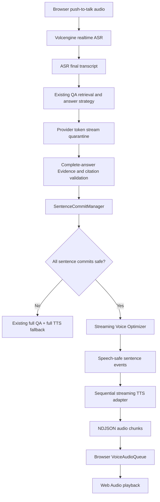

# Streaming Voice Closure

## Scope

This phase connects the existing validated QA sentence stream to browser audio playback. It does not change Memory, Retrieval, lifecycle reasoning, Evidence construction, either answer strategy, or the `VoiceProvider` interface. The existing full-response QA + WAV response remains available as a compatibility and safety fallback.

## Data flow



The QA Provider still returns one structured answer. Raw token deltas remain quarantined and never reach TTS. A sentence is eligible for streaming speech only after the complete answer has passed the existing QA validator and the sentence commit has exact support IDs from the current Evidence allowlist.

## Streaming Voice Optimizer

The streaming projection is intentionally deterministic. It removes citation and presentation syntax, but does not summarize, paraphrase, or infer facts. It rejects the complete turn when any sentence:

- has not passed grounding validation;
- has no sentence-local support;
- references a source outside the final answer's source allowlist;
- contains malformed citation residue; or
- loses a protected uncertainty, lifecycle-state, or ownership boundary during projection.

Preflight is atomic. No earlier speech-safe sentence is released if a later sentence fails. This prevents partial playback followed by a semantically different full-answer fallback.

## Streaming TTS

`streamTextToSpeech()` is an adapter over the existing `VoiceProvider`; the Provider contract is unchanged. It sends one speech-safe sentence at a time and waits for that sentence's `TTSEnded` event before sending the next sentence. Audio chunks receive one monotonic sequence across the turn.

The adapter provides:

- ordered sentence and audio events;
- a bounded audio-chunk queue for server-side backpressure;
- per-sentence timeout and empty-audio detection;
- Provider/session event filtering;
- `AbortSignal` cancellation; and
- listener and iterator cleanup on completion or failure.

If TTS fails before any streamed audio is exposed, the bridge may use the existing full-text TTS path. If failure occurs after playback data has been exposed, it does not replay the answer from the beginning; the text response remains available and the turn is marked with a TTS error.

## Browser transport and playback

The browser opts in with `Accept: application/x-ndjson`. The existing JSON response remains the default for old clients. The stream contains bounded metadata, ordered PCM chunks, the final text answer, and a terminal status. Audio is `pcm_s16le`, 24 kHz, mono.

`VoiceAudioQueue` converts PCM samples to Web Audio buffers and schedules them in sequence. It supports initial buffering, underflow recovery, bounded enqueue backpressure, cancellation, duplicate/empty chunk handling, and deterministic failure for a missing final sequence. A complete WAV event can still use the existing `VoicePlayer` fallback.

## Safety fallback

Streaming speech is withheld when the QA stream falls back, produces an unsupported or validation-fallback result, has no committed sentences, or fails sentence preflight. Those cases use the existing complete-answer validation and full TTS path. No streaming event writes Memory, changes Evidence, or changes the stored `QuestionAnswer`.

## Trace lifecycle

The existing Voice trace adds:

- `first_sentence_committed`;
- `first_safe_sentence`;
- `tts_stream_started`;
- `first_audio_chunk_received`;
- `playback_started`; and
- `stream_completed`.

The primary experience metric is:

```text
speechToFirstAudioPlayMs = playback_started - speech_ended
```

The trace also separates QA-to-safe-sentence time, TTS time-to-first-chunk, server-chunk-to-browser-playback time, and server stream duration. Trace records contain timestamps, status, and enumerated errors only; they do not store transcript text, answer text, audio, Provider responses, or credentials.

## Expected latency impact

This phase removes the requirement to wait for the complete TTS audio file before the browser can start playback. It should reduce the TTS/playback tail from full synthesis duration to the first buffered PCM chunk plus a small scheduling buffer.

It does **not** yet overlap TTS with LLM token generation. `SentenceCommitManager` releases sentences only after the complete structured QA response passes Evidence, citation, lifecycle, scope, and response validation. Therefore the existing QA generation latency remains on the critical path.

## Current limitations

- The current Provider-compatible structured-answer contract does not provide independently final, signed sentence frames, so early raw LLM sentences cannot safely be spoken.
- The browser stream uses request-scoped NDJSON; interrupted HTTP streams are cancelled, not resumed from a server replay buffer.
- Browser `playback_started` is observed when Web Audio is scheduled and telemetry reaches the server, so it includes small scheduling and network-measurement error.
- Streaming TTS is covered with Provider mocks. A controlled real Volcengine multi-sentence streaming smoke test is still required before treating it as production-verified.
- There is no barge-in, VAD, wake word, or cross-device streaming transport in this phase.
